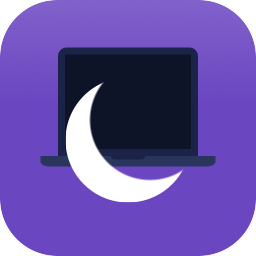
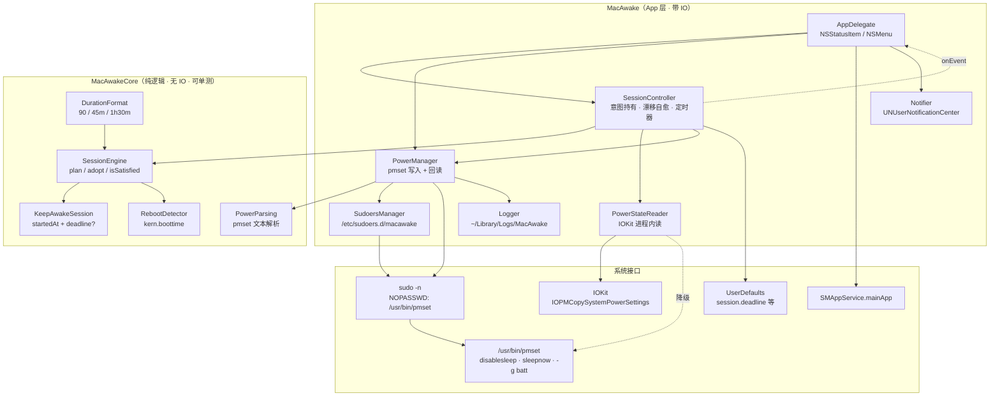
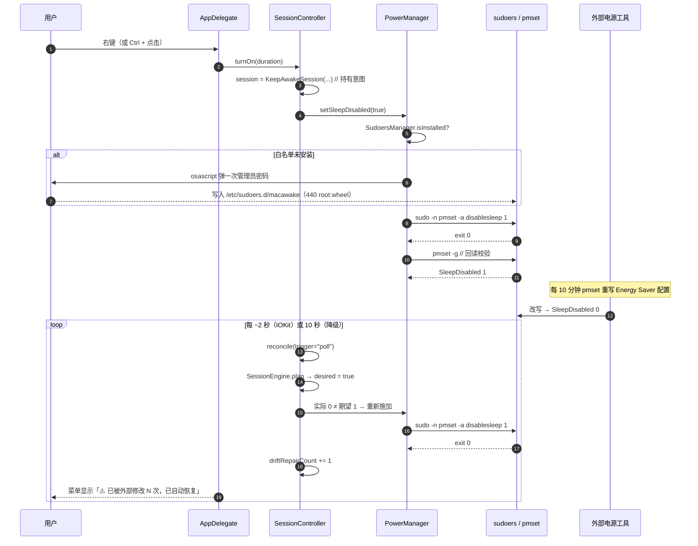
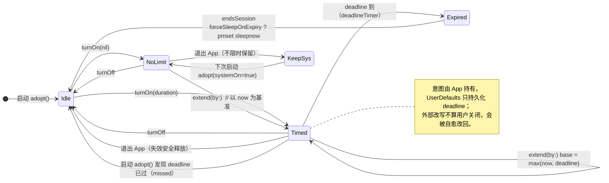
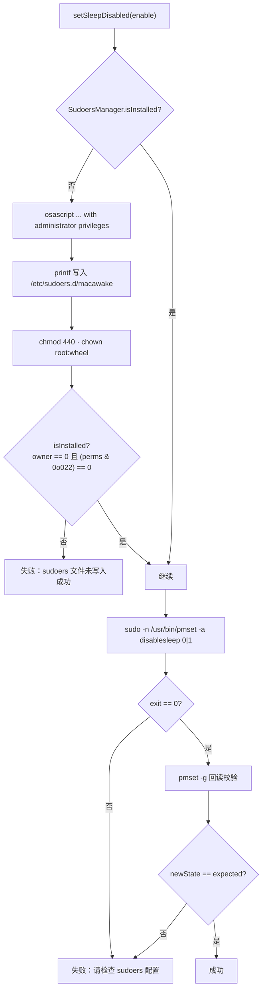
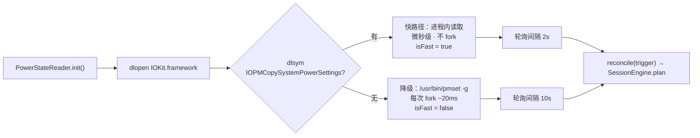
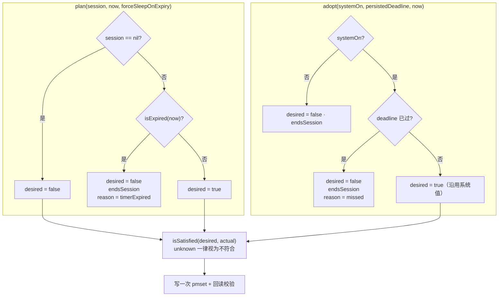

<div align="center">

> [English](./README_en.md) | **简体中文**



# 🌙 MacAwake

**MacBook 合盖不休眠，一个菜单栏按钮说了算。**

点一下「开启」，合上盖子电脑照样跑；到点自动恢复休眠，被别的工具改回去还能自己抢回来。


</div>

---

## 它解决什么问题

macOS 没有「合盖不休眠」的开关 UI。想边合盖边跑编译 / 下资源 / 挂机，只有两条路：要么装一个常驻后台、权限不小的第三方工具，要么手动敲 `sudo pmset -a disablesleep 1`——然后还得记得关回去。

而 `SleepDisabled` 是**全系统共用**的一项电源配置：任何用 `pmset` 写电源设置的程序，都可能把它连带清回 0。于是你常看到的现象是「开着呢，合盖第一次有效，第二次又睡了」。

**MacAwake 用一个单文件菜单栏 App 把这件事收干净：**

- **一个按钮**：左键看菜单、右键直接切换，不需要懂命令行。
- **意图与系统值分离**：App 自己记住「你要开着」，系统值只是需要被持续收敛到的目标——**被外部改掉会自动改回来**（漂移自愈）。
- **最小权限**：只在首次使用弹一次管理员密码，装一条只放行 `/usr/bin/pmset` 的 sudoers 白名单；不装常驻守护进程、不开后台服务。
- **可选定时**：30 分钟 / 1 小时 / 2 小时 / 4 小时 / 自定义 / 不限时，到点自动恢复休眠。

> 隐私承诺：纯本地运行，不联网、不上报、不修改系统以外的东西。
> 唯一写入的持久化位置是 `UserDefaults` 与 `~/Library/Logs/MacAwake/`。

---

## ✨ 功能

- 🌙 **菜单栏图标即状态**：实心月亮 `moon.fill` = 合盖不休眠已开启；线框月亮 `moon` = 默认休眠；读不到状态显示 `moon.zzz`（template 单色，跟随深浅色主题）
- 🖱️ **左键开菜单、右键直接切**：右键（或 `Control` + 点击）无需展开菜单即可切换
- ⏱️ **定时恢复休眠**：预设 30 分钟 / 1 小时 / 2 小时 / 4 小时，或自定义 `90`、`45m`、`1h30m`（1 分钟 – 24 小时）；支持「延长 30 分钟」；可选「到点后强制睡眠」
- 🛡️ **漂移自愈**：每 ~2 秒进程内核对系统值，被外部改写即在 ~2 秒内重新施加；菜单显示「⚠️ 已被外部修改 N 次，已自动恢复」
- 🔋 **电池信息人性化**：默认显示「电量 28% 放电中 剩余约 1 小时」，点击可切到 `pmset -g batt` 原始输出
- 🚀 **可选开机启动**：`SMAppService.mainApp` 注册，无 LaunchAgent 文件
- 🧭 **退出失效安全**：退出 App 时定时会话被释放（承诺无法兑现），不限时会话保持不动
- 📝 **中英双语**：跟随系统语言（`zh-Hans` / `en`）
- 📦 **零依赖**：只用系统框架（AppKit / IOKit / ServiceManagement / UserNotifications），SwiftPM 直接编译

---

## 🚀 快速开始

### 方式一：面向 AI Agent（一键安装，推荐）

把下面这段提示词直接发给你的本地 AI Agent（Claude Code / Codex / OpenCode …）：

````markdown
请帮我从源码安装 MacAwake（GitHub: https://github.com/RayMorTwinkle/MacAwake）。
背景：MacAwake 是一个 macOS 菜单栏工具，用于开关「MacBook 合盖后是否休眠」，
底层通过 sudoers 白名单免密执行 /usr/bin/pmset -a disablesleep 0|1。

环境要求：macOS 13+，已安装 Swift 工具链（若没有则先执行 `xcode-select --install`）。

步骤：
1. 克隆：git clone https://github.com/RayMorTwinkle/MacAwake.git && cd MacAwake
2. 跑单元测试：./scripts/run-tests.sh   （预期输出 "全部通过 61/61"）
3. 构建并组装 .app：./scripts/build.sh 1.2.0
4. 启动：open build/MacAwake.app
5. 首次点击菜单里的「开启合盖不休眠」时，macOS 会弹一次管理员密码框——
   这是安装 /etc/sudoers.d/macawake 白名单，仅放行 pmset 一条命令。
6. 告诉我安装结果，并简述用法（左键菜单 / 右键切换）。
````

### 方式二：面向人类用户

```bash
git clone https://github.com/RayMorTwinkle/MacAwake.git
cd MacAwake
./scripts/run-tests.sh          # 可选：单元测试
./scripts/build.sh 1.2.0        # 编译 + 组装 + ad-hoc 签名，产物在 build/MacAwake.app
open build/MacAwake.app
```

或者直接下载 Release 里的 `.dmg`，把 `MacAwake.app` 拖进 `Applications`。因为 App 是 **ad-hoc 签名（未公证）**，首次运行需一条命令解除 Gatekeeper 拦截：

```bash
xattr -dr com.apple.quarantine /Applications/MacAwake.app && open /Applications/MacAwake.app
```

> **环境要求**：macOS 13+、Swift 6 工具链（`xcode-select --install` 即可）。
> 该命令只移除下载标记，**不需要管理员密码**，且只影响本 App。

---

## 🖥️ 使用

| 操作 | 效果 |
|---|---|
| 右键点击菜单栏图标（或 `Control` + 点击） | 直接切换 合盖不休眠 ⇄ 合盖休眠 |
| 左键点击菜单栏图标 | 打开菜单：状态 + 开关 + 定时 + 电源 + 开机启动 |
| 菜单 → 定时恢复休眠 | 30 分钟 / 1 小时 / 2 小时 / 4 小时 / 自定义… / 不限时 |
| 菜单 → 定时恢复休眠 → 延长 30 分钟 | 定时会话未到点时顺延（仅定时会话可见） |
| 菜单 → 定时恢复休眠 → 到点后强制睡眠 | 到点是「立刻睡」还是「回到系统正常休眠规则」，默认立刻睡 |
| 菜单 → 电源行 | 在自然语言与 `pmset -g batt` 原始输出之间切换 |
| 菜单 → 开机启动 | 开关开机自启（`SMAppService.mainApp`） |

### 首次使用会弹一次密码

点击「开启合盖不休眠」时系统会弹一次管理员密码框。这是**唯一一次**需要密码的地方：App 会在 `/etc/sudoers.d/macawake` 写入一行白名单——

```
<当前用户名> ALL=(root) NOPASSWD: /usr/bin/pmset
```

只允许免密执行 `/usr/bin/pmset` 这一条命令，其余命令照旧需要密码。之后所有开关、`sleepnow` 操作都免密、无弹窗。

### 卸载授权

```bash
# 先退出 MacAwake，否则运行中的 App 会把 disablesleep 自愈回 1
# 恢复「合盖休眠」
sudo pmset -a disablesleep 0

# 移除 sudoers 白名单（卸载 App 时建议执行）
sudo rm -f /etc/sudoers.d/macawake
```

日志（排查问题）：`~/Library/Logs/MacAwake/MacAwake.log`（超过 100 KB 轮转为 `.old`，只保留一代）。

### 行为约定

- **重启后沿用系统当前值**：`pmset` 本就是跨重启持久配置，所以重启后若系统值仍为 1，App 会继续维护该会话并弹一条通知。带到期时间的定时若在 App 未运行期间已过期，启动时会直接恢复休眠（不会变成「永远不休眠」）。
- **退出 App**：定时会话被释放（定时承诺无法兑现，属于失效安全）；不限时会话保持 —— 这样退出 App 不会莫名其妙改掉你的设置。
- **App 运行期间，外部把 `disablesleep` 改成 0 会被自动改回 1**。要真正关掉，请用菜单里的「关闭合盖不休眠」，或先退出 App 再执行 `sudo pmset -a disablesleep 0`。

---

## 🏗️ 架构

### 系统总览

`MacAwakeCore` 是纯逻辑层（不碰 IO、可单测），`MacAwake` 是带 IO 的 App 层。高频读取走 IOKit 进程内私有符号，写入走 `sudo -n pmset`。



### 开关与漂移自愈时序

正常开关只用 `pmset` 一次写入 + 回读校验；真正的难点是下面的自愈循环——外部工具改写后，App 在 ~2 秒内把意图重新施加回去。



### 定时会话状态机

会话由 `KeepAwakeSession` 承载「意图 + 到期时间」。所有状态转移都由纯函数 `SessionEngine` 决定，便于单测锁死。



### sudoers 最小权限流程

`/etc/sudoers.d/` 下的文件若属主/权限不合规，`sudo` 会**静默忽略**（只打一条警告）。所以 `isInstalled` 不只看「文件是否存在」，而是校验属主为 root 且组/全局不可写，否则重写修复。



### 读取后端与轮询策略

「每 2 秒检测一次外部改写」之所以可行，是因为读取走 IOKit 进程内符号（微秒级、不 fork）。符号不可用时自动降级到 `pmset -g`（fork，~20 ms），并**自动把轮询间隔拉长到 10 秒**。



### 决策引擎（纯函数）

`SessionEngine` 不读时钟、不碰系统，所有环境事实由参数注入——这是「行为可被单元测试锁死」的关键。



---

## 📂 目录结构

```text
MacAwake/
├── Package.swift                     # swift-tools 6.0；macOS 13+；三个 target
├── Sources/
│   ├── MacAwakeCore/                 # 纯逻辑（无 IO，可单测）
│   │   ├── Session.swift             # KeepAwakeSession · SessionEngine · RebootDetector
│   │   ├── Duration.swift            # DurationFormat：时长解析 / 拆解
│   │   └── PowerParsing.swift        # SleepState · pmset 文本解析
│   └── MacAwake/                     # 带 IO 的 App 层
│       ├── main.swift                # 入口 + 单实例保护
│       ├── AppDelegate.swift         # 菜单栏 UI / 菜单构建 / 事件处理
│       ├── SessionController.swift   # 意图持久化 · 漂移自愈 · 定时器 · 退出失效安全
│       ├── PowerManager.swift        # pmset 写入 / 回读校验 / sleepnow / 电池解析
│       ├── PowerStateReader.swift    # IOKit 进程内读 SleepDisabled / 合盖状态 / 开机时间
│       ├── SudoersManager.swift      # /etc/sudoers.d/macawake 白名单管理
│       ├── SMAppServiceUtil.swift    # 开机启动（SMAppService.mainApp）
│       ├── Notifier.swift            # 系统通知
│       ├── Icon.swift                # 菜单栏月亮图标
│       ├── Logger.swift              # 日志 + 100KB 轮转
│       └── Resources/                # zh-Hans.lproj / en.lproj Localizable.strings
├── Tests/MacAwakeTests/main.swift    # 自建断言 harness（CLT 环境无 XCTest）
├── Resources/                        # 图标源文件（app-icon.svg / logo.png / AppIcon.icns）
└── scripts/
    ├── build.sh                      # swift build + 组装 .app + ad-hoc 签名
    ├── run-tests.sh                  # 单元测试（61 项）
    ├── make-dmg.sh                   # 打包 UDZO .dmg（含拖拽布局）
    └── make-optimized-icon.sh        # SVG → sips → pngquant → icns
```

---

## 🔧 技术细节

**电源写入只碰一项。** `PowerManager.setSleepDisabled(_:)` 只执行 `/usr/bin/sudo -n /usr/bin/pmset -a disablesleep 0|1`，**不触碰用户的 `sleep`（系统睡眠定时）设置**。`disablesleep=1` 已阻止全部睡眠（含合盖），因此无需改动其它电源项。

**写入必须回读校验。** `setSleepDisabled` 成功后立刻用 `pmset -g` 读回，只有实际值等于期望值才返回 `.success`；否则返回错误并在 UI 提示。任何「已开启」状态都以系统回读结果为准。

**sudoers 的静默陷阱。** `SudoersManager.isInstalled` 的判定是 `owner == 0 && (perms & 0o022) == 0`——权限或属主不合规的文件会被 `sudo` 忽略，只当成「未安装」并在下次操作时重写修复，避免 App 永远卡在「免密失败」。

**IOKit 私有符号 + 自动降级。** `PowerStateReader` 通过 `dlopen` / `dlsym` 拿 `IOPMCopySystemPowerSettings`（非 root 可读），拿到则 `isFast = true`；否则降级 `pmset -g`（fork，~20 ms），由 `SessionController` 把轮询间隔从 **2 秒** 拉到 **10 秒**。

**轮询与定时器参数。** 漂移轮询 `Timer` 间隔 2 s / 10 s、`tolerance = interval * 0.3`；定时到期 `Timer` 延迟 `max(0.05, deadline.timeIntervalSinceNow)`、`tolerance = 0.5`。

**漂移计数的边界。** 只有「期望开启 + 存在会话 + 非用户操作触发」时才计入 `driftRepairCount`；用户自己开关、启动接管都不计数，避免把「自己刚写的」误报为漂移。

**合盖状态下探。** `PowerStateReader.isLidClosed` 读 `IOPMrootDomain` 的 `AppleClamshellState`——**仅用于日志/诊断**，收敛本身不依赖它（有轮询兜底）。

**重启检测。** `RebootDetector.hasRebooted` 比较 `sysctlbyname("kern.boottime")` 的差值，**容差 1 秒**；首次运行（无历史）不算重启，避免误弹通知。

**时长解析规则。** `DurationFormat.parse` 接受 `90`、`90m`、`1h`、`1h30m`、`1.5h`、`1 小时 30 分钟`；范围 **1 分钟 – 24 小时**。采用 `NSRegularExpression` 逐段消费，**段间有空洞**（`1habc30m`）或**末尾有残渣**（`1h30`）一律判非法——宁可报错也不猜。

**持久化的键。** `UserDefaults` 只存 `session.deadline`（自 1970 起的秒）、`session.forceSleepOnExpiry`（默认 true）、`system.lastBootTime`，以及 UI 偏好 `batteryShowRaw`。**「是否开启」不持久化**，以系统 `SleepDisabled` 为准。

**子进程读取防死锁。** `PowerManager.run` 先 `readDataToEndOfFile()` 再 `waitUntilExit()`：若子进程输出超过管道缓冲（64 KB），先等待退出会双方互等死锁。

**电池解析的匹配顺序。** `PowerParsing.chargingState` 的正则 `(not charging|charging|discharging|charged|finishing charge)` 必须把 `not charging` 排在 `charging` 之前，否则会被子串匹配误判成「充电中」。百分比正则 `(\d+)%`、剩余时间正则 `(\d+):(\d+) remaining`。

**退出失效安全。** `releaseOnQuit()` 只释放**定时**会话（定时承诺随进程消失而失效）；**不限时**会话保留，因为 `pmset` 跨重启持久，用户要的是「开着就一直开着」。

**单实例保护。** `main.swift` 用 `NSRunningApplication.runningApplications(withBundleIdentifier:)` 检出同 bundle id 的其它实例并 `exit(0)`，避免出现两个状态栏图标。

**App 元数据。** Bundle ID `com.macawake.MacAwake`，`LSUIElement = YES`（无 Dock 图标，`NSApplication.setActivationPolicy(.accessory)`），最低系统 `13.0`，GPL-3.0。

**测试规模。** `Tests/MacAwakeTests/main.swift` 共 **61 项**断言（解析 / 会话 / 收敛 / 接管 / 漂移判定 / 重启 / 时长），纯函数驱动、CLT 环境无需 XCTest。

---

## ❓ 常见问题

**Q：开启后第一次合盖有效，第二次合盖又睡了？**
A：v1.1.3 及更早存在这个 Bug —— 其它程序用 `pmset` 重写电源配置时把 `SleepDisabled` 清回了 0（本机实测是 AlDente Pro，每 10 分钟一次），而旧版把「系统当前值」当成了「用户意图」。v1.2.0 起由 App 持有意图并持续收敛，会自动改回来。详见「已知冲突」。

**Q：菜单显示「已开启」，但 `pmset -g` 读出来是 0？**
A：正常情况下 App 会在 ~2 秒内改回 1。若长期不是 1，配合菜单里的「⚠️ 已被外部修改 N 次」和日志排查（多半是 sudoers 白名单失效——重新开关一次会重新引导安装）。

**Q：我想手动关掉，为什么 `sudo pmset -a disablesleep 0` 会被改回去？**
A：App 运行期间这就是设计行为（否则别的程序清掉它也没人管）。请用菜单里的「关闭合盖不休眠」，或先退出 App 再执行命令。

**Q：为什么首次使用要输一次管理员密码？之后还会弹吗？**
A：只有首次（以及白名单失效被检出时）。密码用于一次性写入 `/etc/sudoers.d/macawake`，之后所有操作走 `sudo -n` 免密。App 不会以 root 常驻，也不安装任何后台服务。

**Q：会不会覆盖我原来的睡眠设置？**
A：不会。App 只改 `disablesleep` 一项，不碰 `sleep`（系统睡眠定时）等其它电源配置。

**Q：这个 App 联网吗？**
A：不联网，不引入任何第三方依赖，只用系统框架。全部数据都在本机。

---

## ⚠️ 注意事项

- **合盖不休眠会持续耗电和发热**。请把电脑放在通风、坚硬的表面；不要把电脑合盖后塞进包里运行。
- 该设置在**重启后依然生效**（`pmset` 是持久配置）。用完记得关闭，或执行恢复命令。
- 本 App 仅限 **自用 / 局域网分发**。若要做正式商业分发，需 Apple Developer ID 签名 + 公证。
- 读取走的是 IOKit **私有符号** `IOPMCopySystemPowerSettings`；符号不存在时会自动降级到 `pmset -g`（功能不受影响，只是轮询变慢）。

### 已知冲突：其它电源工具会把设置改回去

`SleepDisabled` 是**全系统共用**的一项电源配置，任何用 `pmset` 写电源配置的程序都会连带重写它。

本机实测（macOS 15.3.1 / M1 Max）：**AlDente Pro** 每 10 分钟用 `pmset` 重写一次 Energy Saver 配置，把 `SleepDisabled` 清回 0。用户看到的现象就是「开启合盖不休眠后，只有第一次合盖有效，第二次又恢复原状」。

新版 MacAwake 会在 ~2 秒内自动改回 1，并在菜单里显示「⚠️ 已被外部修改 N 次，已自动恢复」。看到这个提示，说明有别的工具在抢这项设置。

想确认是谁干的：

```bash
# 看最近 10 分钟有哪些进程在跑 pmset（每 10 分钟一次的定时任务最容易认出来）
log show --last 10m --predicate 'process == "pmset"' --style compact | grep activating

# 看电源配置被重写的时刻
log show --last 10m --predicate 'eventMessage CONTAINS "Energy Saver Prefs"' --style compact
```

缓解办法（二选一）：在冲突工具里关掉相关自动化（例如 AlDente 的 Energy Mode 自动切换），或者接受自愈 —— 两者写入周期不同，MacAwake 的 2 秒轮询会稳定赢，不会来回抖动。

---

## 🛠️ 开发

```bash
./scripts/run-tests.sh          # 单元测试（61 项）
./scripts/build.sh 1.2.0        # 构建 build/MacAwake.app（ad-hoc 签名）
./scripts/make-dmg.sh 1.2.0     # 打包 build/MacAwake-1.2.0.dmg
./scripts/make-optimized-icon.sh  # 重新生成 Resources/AppIcon.icns
```

- `build.sh`：`swift build -c release` → 手工组装 `.app`（复制二进制 + 本地化 + 图标 + 生成 `Info.plist`）→ `codesign --force --sign -`。
- `make-dmg.sh`：用 `hdiutil` 先建可写镜像、`AppleScript` 设置 Finder 拖拽布局，再转 `UDZO`（`zlib-level=9`）。
- `make-optimized-icon.sh`：`qlmanage` 渲染 SVG → `sips` 缩放 10 个尺寸 → `pngquant 256` 量化 → 用 Python 直接组装 `.icns`（绕过 `iconutil` 避免二次膨胀，依赖 `brew install pngquant`）。

---

## 📝 更新日志

### v1.2.0
- 🐛 **修复「开启后只有第一次合盖有效，第二次又睡了」**：根因是其它电源工具周期性用 `pmset` 重写 Energy Saver 配置，连带把 `SleepDisabled` 清回 0。新版把「用户意图」与「系统当前值」分离，**每 ~2 秒核对一次，发现漂移立刻重新施加**（IOKit 进程内读取，不 fork；写路径仍是 `pmset` + sudoers 白名单）
- ✨ 新增**定时恢复休眠**：30 分钟 / 1 小时 / 2 小时 / 4 小时 / 自定义（`90`、`45m`、`1h30m`，1 分钟–24 小时）/ 不限时，支持「延长 30 分钟」，到点恢复休眠并强制立即睡眠（可在子菜单里关掉）
- ✨ 重启后沿用系统当前值并弹一条通知；退出 App 时定时会话按失效安全释放
- 📋 菜单显示「⚠️ 已被外部修改 N 次，已自动恢复」，让漂移可见
- ✅ 61 项单元测试通过；真机验证：注入外部改写后 **~2 秒**自愈

### v1.1.3
- 插电未充电时显示「外接电源」，与非插电场景的误报兜底

### v1.1.2
- 不再覆盖用户原有的 `sleep` 设置，等 16 项审查修复

### v1.1.1
- 首个版本：一键切换合盖休眠 + 电池信息 + 开机启动 + 中英双语

---

## 📄 License

[GPL-3.0](LICENSE)

---

## 🙏 致谢

- 图标中的 MacBook 轮廓下载自 [SVG Repo](https://www.svgrepo.com/)（CC0 License，已重新配色并用于 App 图标）
- 参考项目：[LidAwake](https://github.com/NeoSpecies/LidAwake)（功能启发，代码独立实现）

---

<div align="center">
<sub>MacAwake · 合上盖子，继续干活</sub>
</div>
