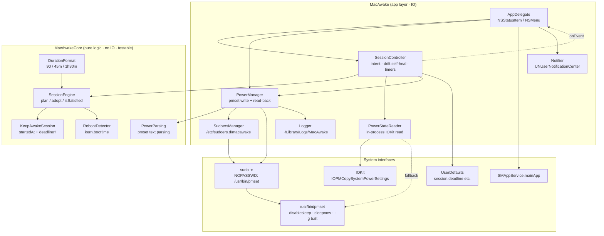
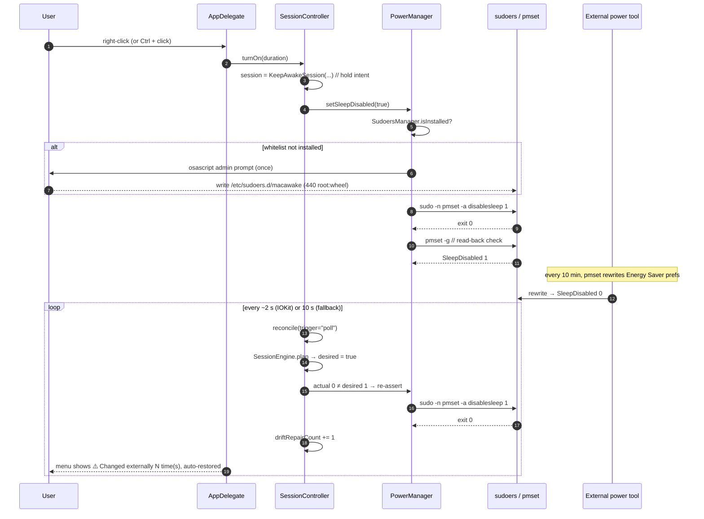
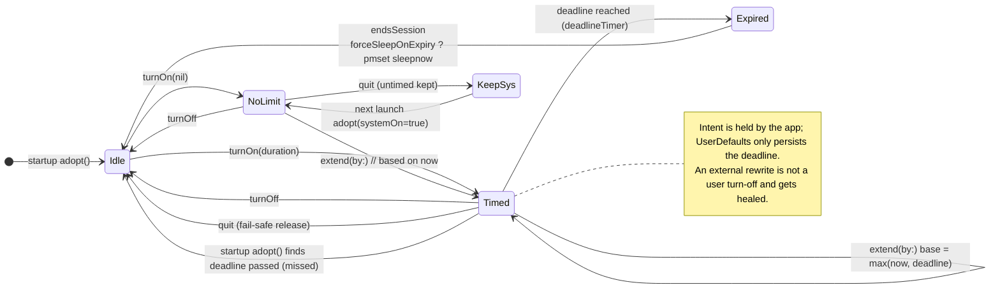
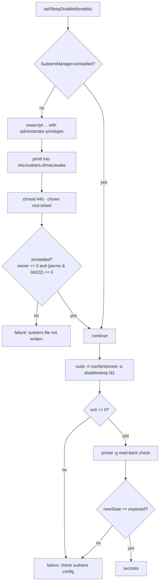
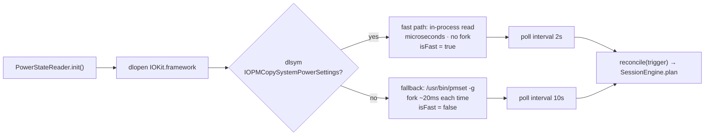
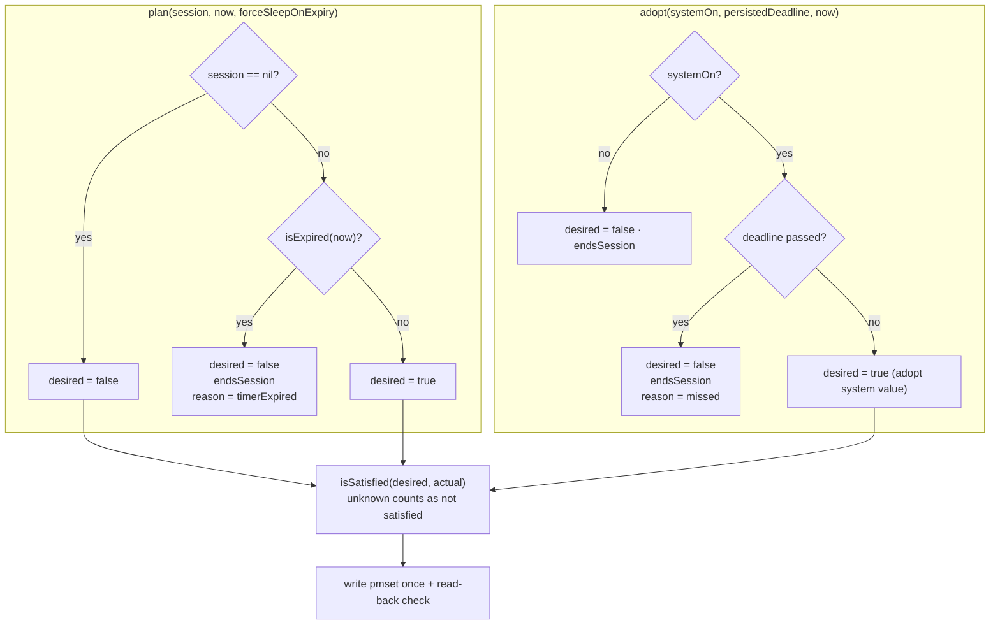

<div align="center">

> **English** | [简体中文](./README.md)


# 🌙 MacAwake

**Keep your MacBook awake with the lid closed — one menu bar button.**

Click "on" and the lid can stay shut while your Mac keeps working; it auto-restores sleep on schedule, and wins back the setting if another tool resets it.


</div>

---

## Why it exists

macOS has no UI switch for "stay awake with the lid closed". To run a build / download / long task with the lid shut, you either install a background daemon with broad privileges, or type `sudo pmset -a disablesleep 1` — and remember to undo it.

Worse, `SleepDisabled` is a **system-wide** power setting: any process that writes power settings via `pmset` can silently clobber it back to 0. That is exactly why "it worked the first time, but fell asleep the second time".

**MacAwake cleans this up with a single-file menu bar app:**

- **One button** — left-click for the menu, right-click to toggle. No terminal needed.
- **Intent separated from system state** — the app remembers what *you* asked for; the system value is just a target to converge to. If something else rewrites it, it gets re-asserted (drift self-healing).
- **Least privilege** — a single admin prompt on first use installs a sudoers whitelist that permits exactly one command, `/usr/bin/pmset`. No daemon, no background service.
- **Optional timer** — 30 min / 1 hr / 2 hr / 4 hr / custom / no limit, auto-restoring sleep when it expires.

> Privacy: fully local. No network, no telemetry, no changes outside the system.
> The only persistence is `UserDefaults` and `~/Library/Logs/MacAwake/`.

---

## ✨ Features

- 🌙 **The menu bar icon is the state** — filled moon `moon.fill` = lid sleep disabled; outline `moon` = default; `moon.zzz` = unreadable (template image, adapts to light/dark)
- 🖱️ **Left-click = menu, right-click = toggle** — right-click (or `Control`-click) toggles without opening the menu
- ⏱️ **Auto-restore timer** — presets 30 min / 1 hr / 2 hr / 4 hr, or custom `90`, `45m`, `1h30m` (1 minute – 24 hours); "Extend by 30 minutes"; optional "force sleep when timer ends"
- 🛡️ **Drift self-healing** — checks the system value in-process every ~2 s and re-asserts within ~2 s; the menu shows "⚠️ Changed externally N time(s); auto-restored"
- 🔋 **Human-readable battery info** — e.g. "Battery 28% Discharging ~1 hr left"; click to toggle the raw `pmset -g batt` output
- 🚀 **Optional launch at login** — via `SMAppService.mainApp`, no LaunchAgent file
- 🧭 **Fail-safe on quit** — timed sessions are released on quit (the timer can't be honored); untimed sessions are kept as-is.
- 📝 **Bilingual** — follows the system language (`zh-Hans` / `en`)
- 📦 **Zero dependencies** — system frameworks only (AppKit / IOKit / ServiceManagement / UserNotifications); builds straight from SwiftPM

---

## 🚀 Quick Start

### Option 1: For an AI Agent (one-shot install, recommended)

Paste this prompt to your local AI Agent (Claude Code / Codex / OpenCode …):

````markdown
Please install MacAwake from source (GitHub: https://github.com/RayMorTwinkle/MacAwake).
Background: MacAwake is a macOS menu bar app that toggles whether the MacBook sleeps
with the lid closed. Under the hood it runs /usr/bin/pmset -a disablesleep 0|1
passwordlessly through a sudoers whitelist.

Requirements: macOS 13+, Swift toolchain installed (if missing, run `xcode-select --install`).

Steps:
1. Clone: git clone https://github.com/RayMorTwinkle/MacAwake.git && cd MacAwake
2. Run unit tests: ./scripts/run-tests.sh   (expect "全部通过 61/61")
3. Build and assemble the .app: ./scripts/build.sh 1.2.0
4. Launch: open build/MacAwake.app
5. The first time you click "Disable lid sleep" in the menu, macOS asks for an admin
   password once — this installs /etc/sudoers.d/macawake, which permits only `pmset`.
6. Report the result and briefly explain usage (left-click = menu, right-click = toggle).
````

### Option 2: For humans

```bash
git clone https://github.com/RayMorTwinkle/MacAwake.git
cd MacAwake
./scripts/run-tests.sh          # optional: unit tests
./scripts/build.sh 1.2.0        # build + assemble + ad-hoc sign → build/MacAwake.app
open build/MacAwake.app
```

Or download the `.dmg` from Releases and drag `MacAwake.app` into `Applications`. The app is **ad-hoc signed (not notarized)**, so the first launch needs one command to clear Gatekeeper:

```bash
xattr -dr com.apple.quarantine /Applications/MacAwake.app && open /Applications/MacAwake.app
```

> **Requirements**: macOS 13+, Swift 6 toolchain (`xcode-select --install`).
> The command above only removes the download flag — **no admin password**, and it affects this app only.

---

## 🖥️ Usage

| Action | Effect |
|---|---|
| Right-click the menu bar icon (or `Control`-click) | Toggle lid-sleep-disabled ⇄ lid sleep immediately |
| Left-click the menu bar icon | Open the menu: state + toggle + timer + power + launch-at-login |
| Menu → Auto-restore sleep after… | 30 min / 1 hr / 2 hr / 4 hr / Custom… / No time limit |
| Menu → Timer → Extend by 30 minutes | Push the deadline out (only when a timed session is active) |
| Menu → Timer → Force sleep when timer ends | Sleep immediately at expiry, or fall back to normal rules (default: sleep now) |
| Menu → Power row | Toggle between human-readable text and raw `pmset -g batt` output |
| Menu → Launch at Login | Toggle launch at login (`SMAppService.mainApp`) |

### First launch asks for a password once

Clicking "Disable lid sleep" triggers a single admin prompt. That is the **only** time a password is needed: the app writes one line to `/etc/sudoers.d/macawake` —

```
<your-username> ALL=(root) NOPASSWD: /usr/bin/pmset
```

It permits passwordless execution of `/usr/bin/pmset` only; every other command still needs a password. After that, all toggles and `sleepnow` are passwordless and prompt-free.

### Removing the authorization

```bash
# Quit MacAwake first, or the running app will self-heal disablesleep back to 1
# Restore lid sleep
sudo pmset -a disablesleep 0

# Remove the sudoers whitelist (recommended when uninstalling)
sudo rm -f /etc/sudoers.d/macawake
```

Logs (for troubleshooting): `~/Library/Logs/MacAwake/MacAwake.log` (rotates to `.old` past 100 KB, one generation kept).

### Semantics

- **After a reboot, the current system value is adopted**: `pmset` is persistent across reboots, so if the value is still 1 the app keeps maintaining that session and posts a notification. A persisted timer that expired while the app wasn't running is released at startup (it never becomes "awake forever").
- **Quitting the app**: timed sessions are released (the promise can't be honored — fail-safe); untimed sessions are kept, so quitting doesn't silently change your setting.
- **While the app is running, an external change of `disablesleep` to 0 is automatically reverted to 1.** To truly turn it off, use "Enable lid sleep" in the menu, or quit the app first and run `sudo pmset -a disablesleep 0`.

---

## 🏗️ Architecture

### System overview

`MacAwakeCore` is the pure-logic layer (no IO, unit-testable); `MacAwake` is the IO-bearing app layer. High-frequency reads go through an in-process IOKit private symbol; writes go through `sudo -n pmset`.



### Toggle & drift self-healing sequence

A normal toggle is one write plus a read-back check. The hard part is the healing loop below — after an external tool rewrites the value, the app re-asserts intent within ~2 s.



### Timed-session state machine

A session carries "intent + deadline" in `KeepAwakeSession`. All transitions are decided by the pure `SessionEngine`, which makes them unit-testable.



### Least-privilege sudoers flow

If a file under `/etc/sudoers.d/` has the wrong owner/mode, `sudo` **silently ignores** it (a warning only). So `isInstalled` doesn't just check existence — it verifies owner is root and group/world are not writable, otherwise it rewrites and repairs.



### Read backend & polling policy

Checking for external rewrites every 2 seconds is only viable because reads go through an in-process IOKit symbol (microseconds, no fork). When the symbol is unavailable it falls back to `pmset -g` (fork, ~20 ms) and **automatically stretches the poll interval to 10 seconds**.



### Decision engine (pure functions)

`SessionEngine` reads no clock and touches no system state — every environmental fact is injected as a parameter. That is the key to behavior being locked down by unit tests.



---

## 📂 Project layout

```text
MacAwake/
├── Package.swift                     # swift-tools 6.0; macOS 13+; three targets
├── Sources/
│   ├── MacAwakeCore/                 # pure logic (no IO, unit-testable)
│   │   ├── Session.swift             # KeepAwakeSession · SessionEngine · RebootDetector
│   │   ├── Duration.swift            # DurationFormat: parse / decompose
│   │   └── PowerParsing.swift        # SleepState · pmset text parsing
│   └── MacAwake/                     # IO-bearing app layer
│       ├── main.swift                # entry point + single-instance guard
│       ├── AppDelegate.swift         # menu bar UI / menu building / event handling
│       ├── SessionController.swift   # intent persistence · drift self-heal · timers · quit fail-safe
│       ├── PowerManager.swift        # pmset write / read-back / sleepnow / battery parsing
│       ├── PowerStateReader.swift    # in-process IOKit reads: SleepDisabled / clamshell / boot time
│       ├── SudoersManager.swift      # /etc/sudoers.d/macawake whitelist management
│       ├── SMAppServiceUtil.swift    # launch at login (SMAppService.mainApp)
│       ├── Notifier.swift            # system notifications
│       ├── Icon.swift                # menu bar moon icons
│       ├── Logger.swift              # logging + 100 KB rotation
│       └── Resources/                # zh-Hans.lproj / en.lproj Localizable.strings
├── Tests/MacAwakeTests/main.swift    # self-built assertion harness (no XCTest under CLT)
├── Resources/                        # icon sources (app-icon.svg / logo.png / AppIcon.icns)
└── scripts/
    ├── build.sh                      # swift build + assemble .app + ad-hoc sign
    ├── run-tests.sh                  # unit tests (61 items)
    ├── make-dmg.sh                   # pack a UDZO .dmg (with drag layout)
    └── make-optimized-icon.sh        # SVG → sips → pngquant → icns
```

---

## 🔧 Technical notes

**The write touches exactly one key.** `PowerManager.setSleepDisabled(_:)` runs only `/usr/bin/sudo -n /usr/bin/pmset -a disablesleep 0|1` and **never touches the user's `sleep` (system sleep timer) setting**. `disablesleep=1` already blocks all sleep (including lid), so no other power key needs changing.

**Writes must be verified.** After `setSleepDisabled` succeeds it immediately reads back via `pmset -g`, and only returns `.success` when the actual value equals the expected one; otherwise it returns an error and the UI shows it. Any "on" state is taken from the system read-back.

**The sudoers silent trap.** `SudoersManager.isInstalled` checks `owner == 0 && (perms & 0o022) == 0`. A file with the wrong owner or mode is ignored by `sudo`; it is treated as "not installed" and rewritten on the next operation, so the app never gets stuck on "passwordless failed".

**IOKit private symbol + auto fallback.** `PowerStateReader` obtains `IOPMCopySystemPowerSettings` via `dlopen` / `dlsym` (readable without root). If found, `isFast = true`; otherwise it falls back to `pmset -g` (fork, ~20 ms), and `SessionController` stretches the poll interval from **2 s** to **10 s**.

**Polling & timer parameters.** The drift poll `Timer` uses 2 s / 10 s with `tolerance = interval * 0.3`; the deadline `Timer` uses `max(0.05, deadline.timeIntervalSinceNow)` with `tolerance = 0.5`.

**Drift-count boundary.** Only "desired on + session exists + not user-triggered" increments `driftRepairCount`; user toggles and startup adoption never count, so a value the app just wrote is never misreported as drift.

**Lid-state probe.** `PowerStateReader.isLidClosed` reads `AppleClamshellState` from `IOPMrootDomain` — used **for logging/diagnostics only**; convergence does not depend on it (polling is the backstop).

**Reboot detection.** `RebootDetector.hasRebooted` compares `sysctlbyname("kern.boottime")` values with a **1-second tolerance**; a first run (no history) is not treated as a reboot, avoiding a spurious notification.

**Duration parsing rules.** `DurationFormat.parse` accepts `90`, `90m`, `1h`, `1h30m`, `1.5h`, `1 小时 30 分钟`; the range is **1 minute – 24 hours**. It consumes matches with `NSRegularExpression`; a **gap between matches** (`1habc30m`) or **leftover trailing characters** (`1h30`) is rejected outright — it would rather error than guess.

**Persisted keys.** `UserDefaults` stores only `session.deadline` (seconds since 1970), `session.forceSleepOnExpiry` (default true), `system.lastBootTime`, plus the UI preference `batteryShowRaw`. **"Is it on" is not persisted** — the system `SleepDisabled` is the source of truth.

**Deadlock-safe subprocess reads.** `PowerManager.run` calls `readDataToEndOfFile()` before `waitUntilExit()`: if the child writes more than the pipe buffer (64 KB), waiting for exit first would deadlock.

**Battery parsing match order.** The regex in `PowerParsing.chargingState`, `(not charging|charging|discharging|charged|finishing charge)`, must place `not charging` before `charging`, or the substring match would misread it as "charging". Percent regex `(\d+)%`, remaining-time regex `(\d+):(\d+) remaining`.

**Quit fail-safe.** `releaseOnQuit()` releases only **timed** sessions (their promise dies with the process); **untimed** sessions are kept, because `pmset` survives reboots and the user wants "on means on".

**Single-instance guard.** `main.swift` detects other instances with the same bundle id via `NSRunningApplication.runningApplications(withBundleIdentifier:)` and `exit(0)`, avoiding two menu bar icons.

**App metadata.** Bundle ID `com.macawake.MacAwake`, `LSUIElement = YES` (no Dock icon, `NSApplication.setActivationPolicy(.accessory)`), minimum `13.0`, GPL-3.0.

**Test coverage.** `Tests/MacAwakeTests/main.swift` holds **61 assertions** (parsing / session / convergence / adoption / drift / reboot / duration), all pure-function driven with no XCTest needed under CLT.

---

## ❓ FAQ

**Q: It worked the first lid-close but slept the second time?**
A: That was fixed in v1.2.0. The root cause: other tools rewrite power config via `pmset` and clobber `SleepDisabled` back to 0 (observed locally: AlDente Pro, every 10 minutes), while older versions treated "current system value" as "user intent". Since v1.2.0 the app holds the intent and keeps converging. See "Known conflict".

**Q: The menu says "on" but `pmset -g` reads 0?**
A: Normally the app reverts it within ~2 s. If it stays 0, use the menu's "⚠️ Changed externally N time(s)" and the logs (usually a broken sudoers whitelist — toggling once re-bootstraps it).

**Q: I want to turn it off manually; why does `sudo pmset -a disablesleep 0` get reverted?**
A: While the app is running that is by design (otherwise another program could silently clear it). Use "Enable lid sleep" in the menu, or quit the app first.

**Q: Why one admin prompt on first use? Will it prompt again?**
A: Only once (and again only if the whitelist is found broken). The password installs `/etc/sudoers.d/macawake`; afterwards everything uses `sudo -n`. The app never runs as root persistently and installs no background service.

**Q: Does it overwrite my existing sleep settings?**
A: No. It changes only `disablesleep`, never `sleep` (the system sleep timer) or other power settings.

**Q: Does this app use the network?**
A: No network, no third-party dependencies, system frameworks only. Everything stays local.

---

## ⚠️ Notes

- **Lid-sleep-disabled keeps drawing power and generating heat.** Put the Mac on a ventilated, hard surface; never run it closed in a bag.
- The setting **persists across reboots** (`pmset` is persistent). Remember to turn it off or run the restore command.
- This app is for **personal / LAN use only**. Formal commercial distribution requires an Apple Developer ID signature + notarization.
- Reads use the IOKit **private symbol** `IOPMCopySystemPowerSettings`; when unavailable it falls back to `pmset -g` automatically (functionality is unaffected; polling is just slower).

### Known conflict: other power tools rewrite the setting

`SleepDisabled` is a **system-wide** power setting; any program that writes power config via `pmset` rewrites it along the way.

Observed locally (macOS 15.3.1 / M1 Max): **AlDente Pro** rewrites the Energy Saver config with `pmset` every 10 minutes, clearing `SleepDisabled` back to 0. The symptom is "after enabling, only the first lid-close works; the second reverts".

Newer MacAwake reverts it within ~2 s and shows "⚠️ Changed externally N time(s); auto-restored" in the menu. If you see that, another tool is competing for the setting.

To find the culprit:

```bash
# Which processes ran pmset in the last 10 minutes (a 10-minute cadence is a giveaway)
log show --last 10m --predicate 'process == "pmset"' --style compact | grep activating

# When the power config was rewritten
log show --last 10m --predicate 'eventMessage CONTAINS "Energy Saver Prefs"' --style compact
```

Mitigation (pick one): disable the relevant automation in the competing tool (e.g. AlDente's Energy Mode auto-switching), or accept the self-healing — the write cycles differ, so MacAwake's 2-second poll reliably wins without oscillating.

---

## 🛠️ Development

```bash
./scripts/run-tests.sh          # unit tests (61 items)
./scripts/build.sh 1.2.0        # build build/MacAwake.app (ad-hoc signed)
./scripts/make-dmg.sh 1.2.0     # pack build/MacAwake-1.2.0.dmg
./scripts/make-optimized-icon.sh  # regenerate Resources/AppIcon.icns
```

- `build.sh`: `swift build -c release` → assemble the `.app` by hand (binary + localizations + icon + generated `Info.plist`) → `codesign --force --sign -`.
- `make-dmg.sh`: `hdiutil` creates a writable image, `AppleScript` sets the Finder drag layout, then converts to `UDZO` (`zlib-level=9`).
- `make-optimized-icon.sh`: `qlmanage` renders the SVG → `sips` scales 10 sizes → `pngquant 256` quantizes → a Python script assembles the `.icns` directly (bypassing `iconutil` to avoid re-inflation; needs `brew install pngquant`).

---

## 📝 Changelog

### v1.2.0
- 🐛 **Fixed "only the first lid-close works"**: root cause was other power tools periodically rewriting the Energy Saver config via `pmset`, clobbering `SleepDisabled` back to 0. The new version separates "user intent" from "current system value" and **reconciles every ~2 s, re-asserting on drift** (in-process IOKit read, no fork; the write path is still `pmset` + sudoers whitelist)
- ✨ Added **auto-restore timer**: 30 min / 1 hr / 2 hr / 4 hr / custom (`90`, `45m`, `1h30m`, 1 min–24 h) / no limit, with "Extend by 30 minutes"; restores sleep on expiry and optionally forces sleep immediately (toggleable in the submenu)
- ✨ Adopts the current system value after reboot with a notification; timed sessions are released on quit as a fail-safe
- 📋 Menu shows "⚠️ Changed externally N time(s); auto-restored", making drift visible
- ✅ 61 unit tests pass; verified on real hardware: external rewrites heal within **~2 s**

### v1.1.3
- Show "AC Power" when plugged in but not charging; guards against false reports in the non-plugged case

### v1.1.2
- No longer overwrites the user's existing `sleep` setting; plus 16 review fixes

### v1.1.1
- First release: one-click lid-sleep toggle + battery info + launch at login + bilingual UI

---

## 📄 License

[GPL-3.0](LICENSE)

---

## 🙏 Credits

- The MacBook outline in the icon is from [SVG Repo](https://www.svgrepo.com/) (CC0 License; recolored and used for the app icon)
- Reference project: [LidAwake](https://github.com/NeoSpecies/LidAwake) (feature inspiration; independent implementation)

---

<div align="center">
<sub>MacAwake · Close the lid, keep working</sub>
</div>
